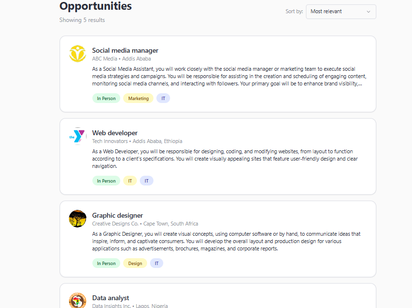
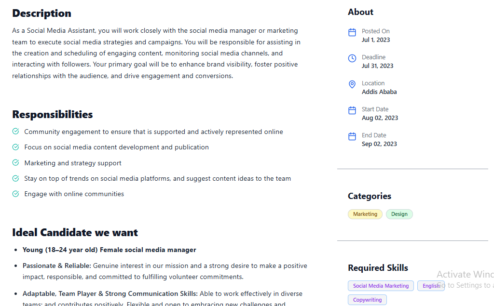

# Job Listing Application

This is a modern, responsive **Job Listing Dashboard** built with **Next.js**, **React**, **Tailwind CSS**, and **TypeScript**. The goal is to replicate a detailed job listing and description interface based on a Figma UI design. It features dynamic job data fetched directly from a remote API, clean navigation, and design precision.

---

## What We Implemented

* **Job Cards UI:** Reusable `JobCard` components styled to match the design exactly.  
* **Job Detail Page:** Built with proper layout, icons, fonts, and spacing following the reference.  
* **Ideal Candidate Block:** Correct layout and styling for candidate traits, age, and gender.  
* **Mobile Responsive:** Fully responsive layout optimised for different screen sizes.  
* **API Data Integration:** Job listings and details are dynamically fetched from the remote API endpoint (`https://akil-backend.onrender.com/opportunities/search`) using the native JavaScript `fetch` API.  
* **Dynamic Routing:** Implemented dynamic routes for detailed job pages based on job IDs fetched via `fetch`.  


---

## Screenshots

### 📌 Job Listing View



---

### 📌 Job Description View



---

## 🛠️ Tech Stack

* ⚛️ **Next.js** (React Framework)  
* 🎨 **Tailwind CSS** (Utility-first CSS)  
* 🔠 **TypeScript** (Typed JavaScript)  
* 🧩 **Radix UI** (Accessible UI components)  
* 📡 **API Integration** (Remote job listings API via `fetch`)

---

## 🚀 How to Run This Project

1. **Clone the Repository**

```bash
git clone https://github.com/Fenet-damena/job-listing-application.git
cd job-listing-application
````

2. **Install Dependencies**

```bash
npm install
```

3. **Start the Dev Server**

```bash
npm run dev
```

4. **Open in Your Browser**

[http://localhost:3000](http://localhost:3000)

---

## 👩‍💻 Author

**Fenet Damena**

