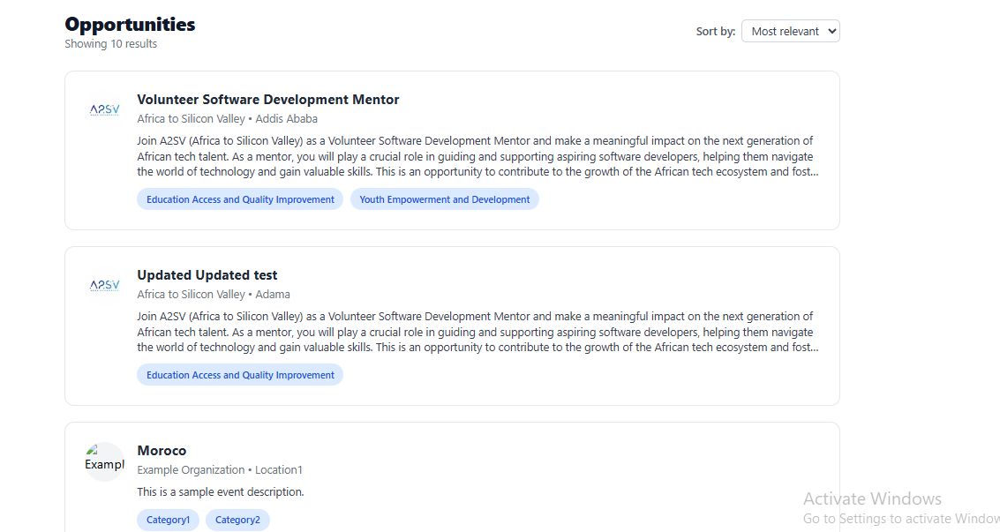

# Job Listing Application

This project is built using **React**, and **Tailwind CSS**. The goal is to design and develop a responsive and accessible job listing dashboard, featuring individual job cards and a detailed job description view, based on a given UI reference.

---

##  What I Implemented

- Created a **JobCard** React component closely matching the provided design.
- Used dummy JSON data to populate each job listing.
- Integrated avatar images for each job (as shown in the design).
- Built the full job listing dashboard with Tailwind CSS styling.
- Included a separate view for job descriptions with a clean layout.
- Followed all UI and layout instructions from the provided Figma design.

---

## 🖼️ Screenshots

### 📌 Job Listing View



---

### 📌 Job Description View


---

## 🛠️ Built With

- **React**
- **Tailwind CSS**
- **TypeScript**
- **Radix UI (Select)** for dropdown filtering

---

##  How to Run the Project

Follow these steps to run the project locally:

1. **Clone the Repository**

```bash
git clone https://github.com/Fenet-damena/job-listing-application.git
cd job-listing-application
````

2. **Install Dependencies**

```bash
npm install
```

3. **Run the Development Server**

```bash
npm run dev
```

4. Open your browser and go to [http://localhost:3000](http://localhost:3000)

---

### 👩 Author

**Fenet Damena**
